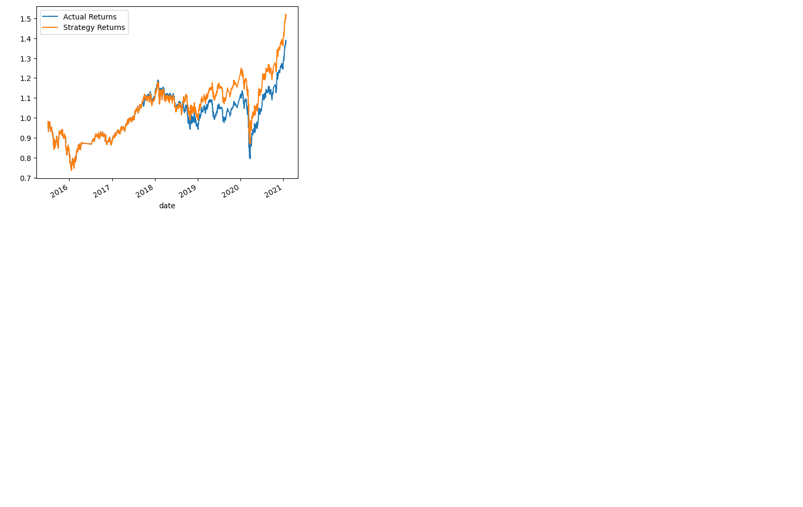
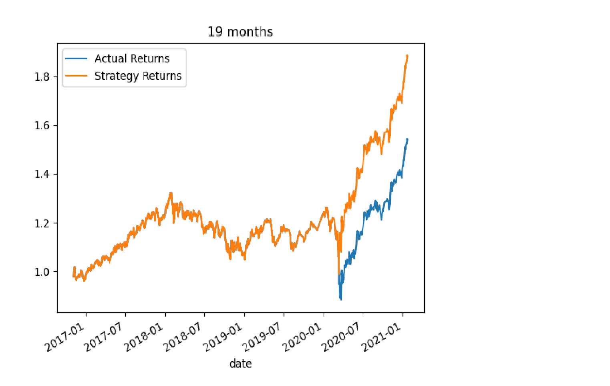
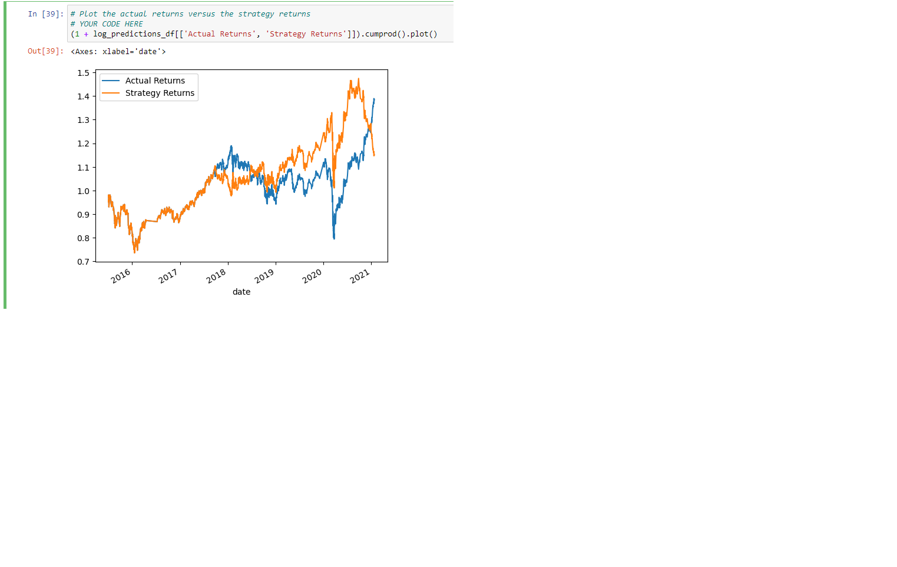

# Algorithmic Trading Bot with Machine Learning

## Overview

In this project, we assume the role of a financial advisor at a top-tier financial advisory firm. The goal is to enhance the existing algorithmic trading systems by integrating machine learning algorithms that can adapt to new data and evolving markets. The objective is to create an algorithmic trading bot that learns and adapts to new data, thereby maintaining the firm's competitive advantage in the market.

## Table of Contents

- [Baseline Performance](#baseline-performance)
- [Tuning the Trading Algorithm](#tuning-the-trading-algorithm)
- [Evaluating a New Machine Learning Classifier](#evaluating-a-new-machine-learning-classifier)
- [Evaluation Report](#evaluation-report)
- [Conclusions](#conclusions)

## Baseline Performance

The baseline trading algorithm demonstrated compelling performance, closely matching the market until mid-2018. From that point, it began to surpass the market's results. The algorithm exceeded the market's cumulative return by approximately 2 points.

However, the classification matrix indicates room for improvement. While the algorithm exhibits a satisfactory ability to signal when to adopt a long position, its capacity to accurately determine when to go short is inadequate.

## Tuning the Trading Algorithm

### Adjusting Date Window:

- **1 Month**: Consistently better results.
- **2-3 Months**: Equal to actual returns for a good amount with better results after halfway through 2018.
- **4-5 Months**: Equal except for worse results from 2019-2020.
- **6-7 Months**: Equal until better results post-2018.
- **8-9 Months**: Mostly worse, except for 9 which has slightly better results from 2018-2019.
- **10 Months**: Consistently worse.
- **11-17 Months**: Equal to actual returns.
- **18-19 Months**: Equal until 2020, then outpaces actual.
- **20 Months**: Slightly worse from halfway 2018-2019 until outpaces it 2020 onward.
- **21 Months**: Worse from 2018-2020 then same again.
- **22 Months**: Equal until starts being worse at halfway 2018 until 2020 then outpaces.
- **23 Months**: Equal until 2018 then worse until 2020 outpaces.
- **24-25 Months**: Equal until halfway 2020 then outpaces.
- **26-68 Months**: Equal with actual.

The best offset amount of time seems to be 19 months. Adjusting the windows, the best results were achieved with a 3 months offset with 4, 75. However, 4, 100 with a 19 months offset was still better.

## Evaluating a New Machine Learning Classifier

For this evaluation, we used the Logistic Regression model. The model outperformed the actual return until 2021, where it performed significantly worse. However, the default parameters for the SVR model outperformed the Logistic Regression model.

## Evaluation Report

The project involved implementing and tuning an algorithmic trading strategy using machine learning. The baseline model provided a solid foundation, but through tuning and evaluation, we identified areas of improvement. The best results were achieved with the default parameters for the SVR model with an offset of 19 months. While the Logistic Regression model showed promise, it did not outperform the SVR model.

## Conclusions

The integration of machine learning into algorithmic trading offers significant potential. While the baseline model demonstrated strong performance, there's always room for improvement. Through tuning and evaluation, we can optimize the trading strategy to achieve better returns. The SVR model, with specific parameters, proved to be the most effective in our evaluations.
