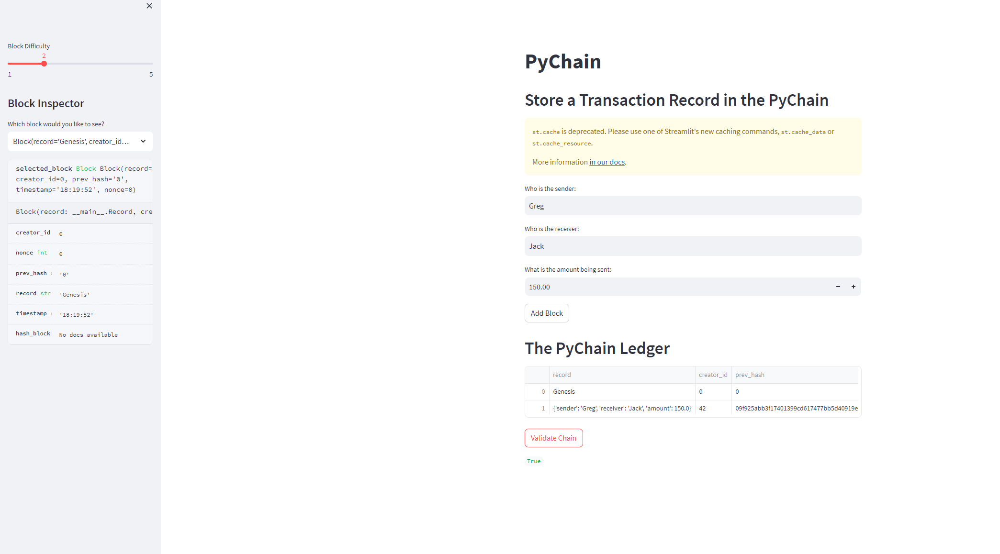

# PyChain Ledger

The PyChain Ledger is a simple blockchain implementation using Python and Streamlit. This project allows users to add transaction records to the blockchain and validate the integrity of the entire chain.

## Features

- **Record Data Class**: A blueprint for the financial transaction records that the blocks of the ledger will store.
- **Block Data Class**: Represents a block in the blockchain, containing a record of a financial transaction.
- **Streamlit Interface**: A user-friendly interface to input transaction details and add them to the blockchain.
- **Blockchain Validation**: Validates the integrity of the blockchain to ensure no blocks have been tampered with.

## Installation

1. Ensure you have Python installed.
2. Clone this repository.
3. Navigate to the project directory and install the required packages:

```bash
pip install streamlit pandas
```


4. Run the Streamlit app:

```bash
streamlit run pychain.py
```

## Usage

1. Open the Streamlit app in your browser.
2. Input the sender, receiver, and amount for a transaction.
3. Click "Add Block" to add the transaction to the blockchain.
4. You can inspect any block in the blockchain using the "Block Inspector" on the sidebar.
5. Validate the integrity of the entire blockchain by clicking the "Validate Chain" button.

## Screenshots


*App Page showing the PyChain Ledger with multiple blocks.*



*Blockchain validation result indicating the integrity of the chain.*

## License

This project is open source and available under the [MIT License](LICENSE).
