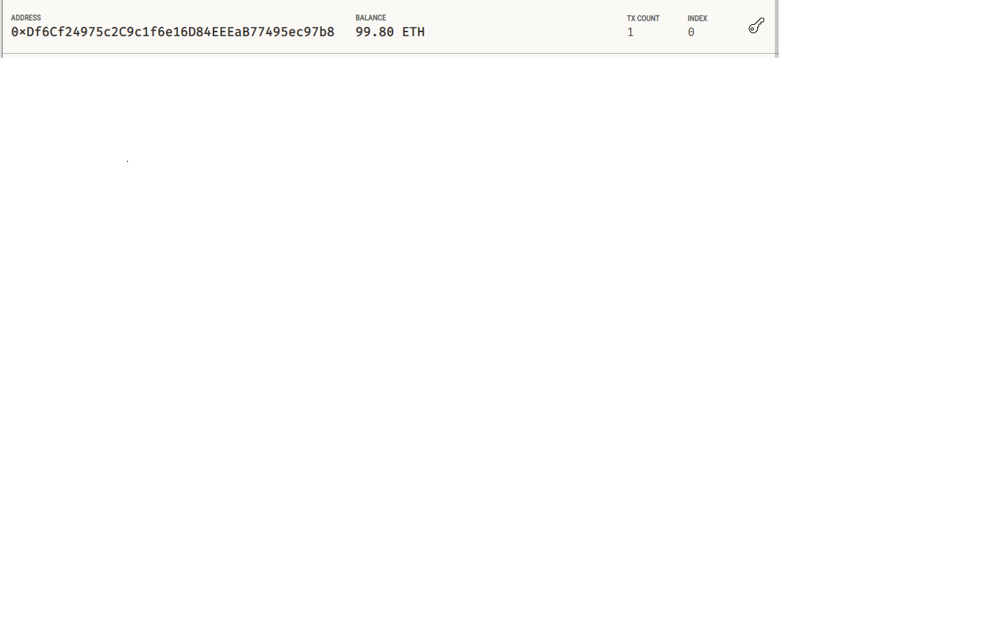
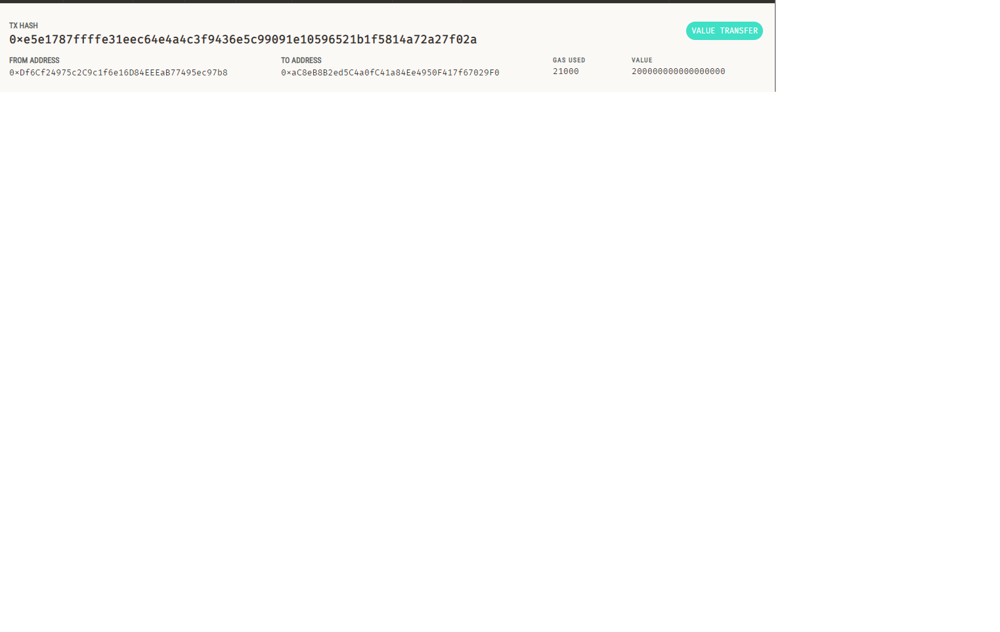

# Fintech Finder

The Fintech Finder application allows users to hire fintech professionals using Ethereum. Users can select a fintech professional from the application interface, input the number of hours for which they'll hire the worker, and then send an Ethereum blockchain transaction to pay the hired candidate.

## Table of Contents

- [Installation](#installation)
- [Usage](#usage)
- [Screenshots](#screenshots)

## Installation

1. Clone the repository to your local machine.
2. Navigate to the project folder.
3. Activate your Conda `dev` environment.
4. Ensure you have all the required libraries installed.
5. Add your mnemonic seed phrase (provided by Ganache) to the `SAMPLE.env` file and rename the file to `.env`.

## Usage

1. From your terminal, navigate to the project folder.
2. Launch the Streamlit application by typing:

```bash
streamlit run fintech_finder.py
```
3. On the resulting webpage:
- Select a fintech professional from the drop-down menu.
- Enter the number of hours you'd like to hire them for.
- Click the "Send Transaction" button to sign and send the transaction.
4. If the transaction is successful, a transaction hash code will be displayed on the Streamlit application sidebar.

## Screenshots

### Ganache Account



### Transaction Details


